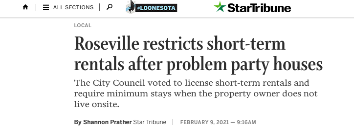
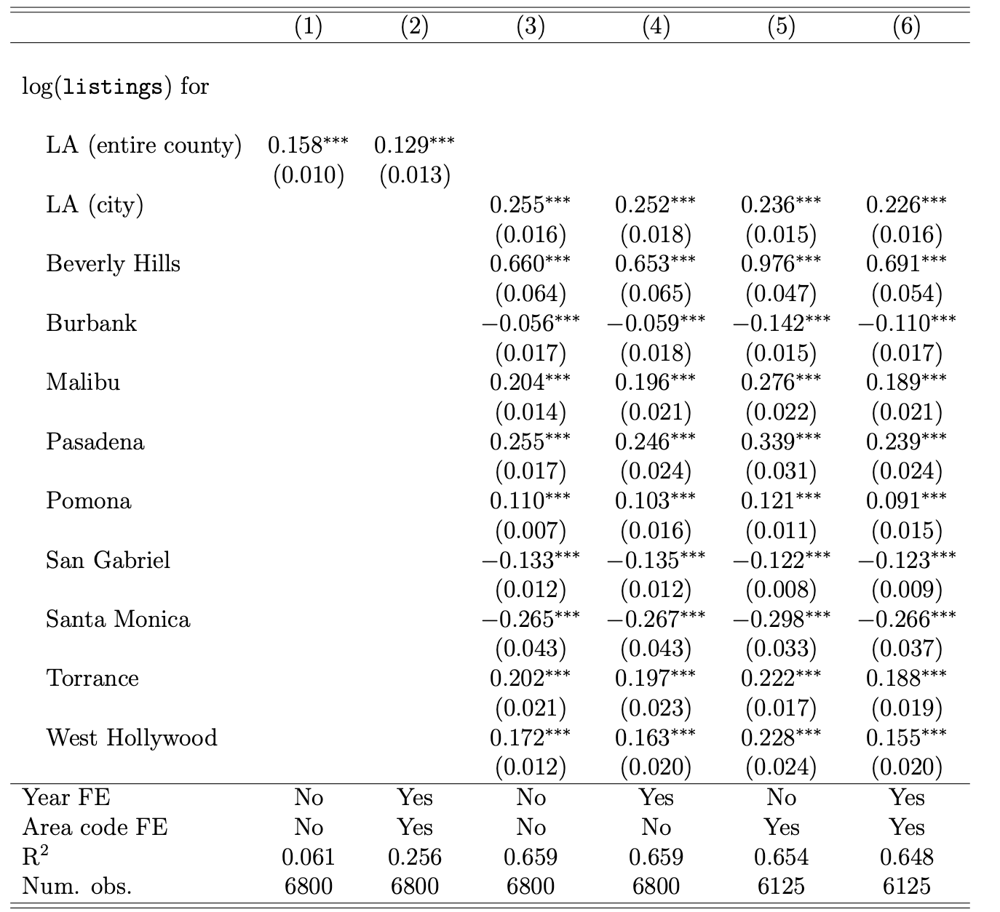
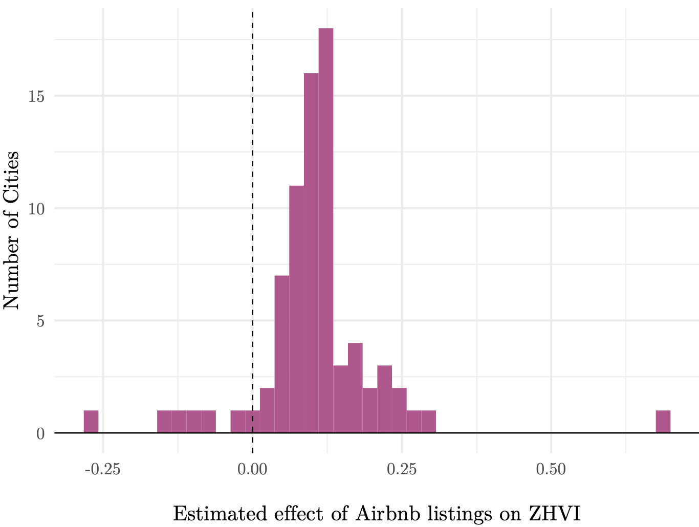
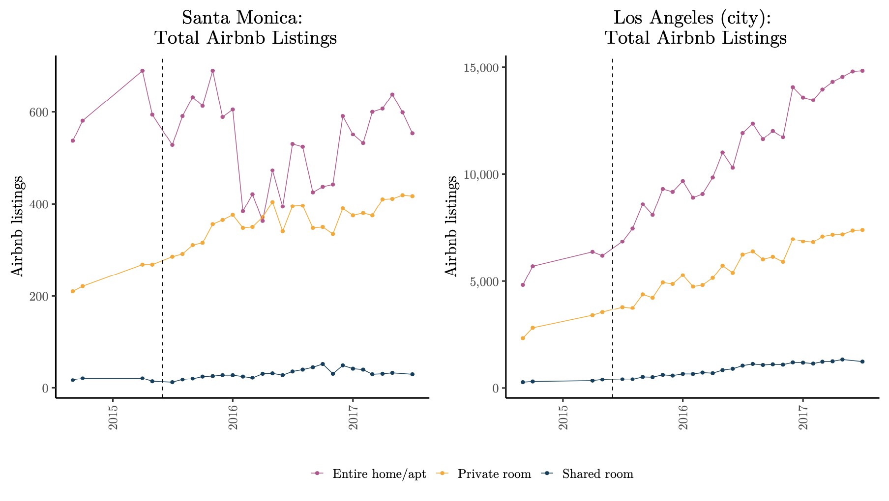
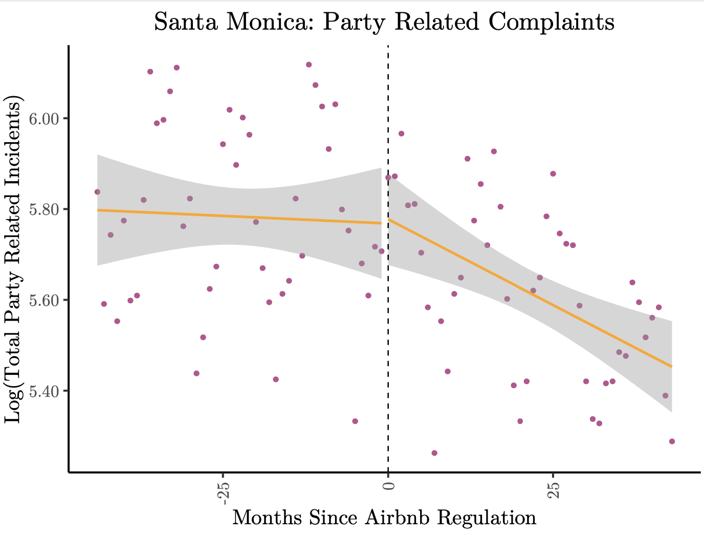
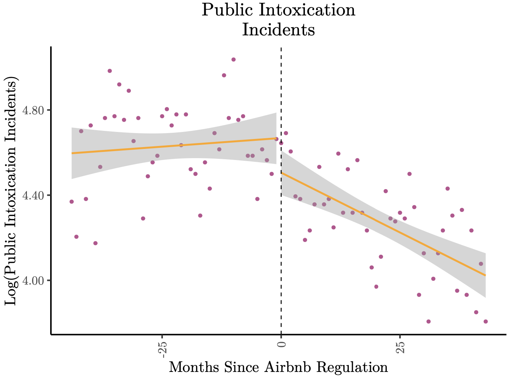

```{R, setup, include = F}
#class: inverse, center, middle

options(htmltools.dir.version = FALSE)
library(pacman)
p_load(
  broom, here, tidyverse,
  latex2exp, ggplot2, ggthemes, viridis, extrafont, gridExtra,
  kableExtra,evaluate,showtext,
  dplyr, magrittr, knitr, parallel, 
  tufte,emo, ggrepel, sf,xaringanthemer
)
# Define pink color


```


# Research Overview

__Research Q:__ How do short-term rentals (STRs) impact housing prices?


&#8594; _A lot of papers:_ more STRs $\implies$ higher prices! (why?)<sup>__†__</sup>


.footnote[
__†__ See Calder-Wang (2019), Fonsesca (2019), Barron et al. (2020), Garcia-López et al. (2020), Valentin (2021) for examples
]  


---

count: false
# Research Overview

__Research Q:__ How do short-term rentals (STRs) impact housing prices?


&#8594; _A lot of papers:_ more STRs $\implies$ higher prices! (why?)<sup>__†__</sup>


.footnote[
__†__ See Calder-Wang (2019), Fonsesca (2019), Barron et al. (2020), Garcia-López et al. (2020), Valentin (2021) for examples
]  
&#8594; Option value of owning a home increases $\implies$ higher demand $\implies$ higher prices. QED

  
  
---


count: false
# Research Overview

__Research Q:__ How do short-term rentals (STRs) impact housing prices?


&#8594; _A lot of papers:_ more STRs $\implies$ higher prices! (why?)<sup>__†__</sup>


.footnote[
__†__ See Calder-Wang (2019), Fonsesca (2019), Barron et al. (2020), Garcia-López et al. (2020), Valentin (2021) for examples
]  
&#8594; Option value of owning a home increases $\implies$ higher demand $\implies$ higher prices. QED

  
## Is that it?

&#8594; Could STRs lower housing values under any circumstances? We think so


---

count: false
# Research Overview

__Research Q:__ How do short-term rentals (STRs) impact housing prices?


&#8594; _A lot of papers:_ more STRs $\implies$ higher prices! (why?)<sup>__†__</sup>


.footnote[
__†__ See Calder-Wang (2019), Fonsesca (2019), Barron et al. (2020), Garcia-López et al. (2020), Valentin (2021) for examples
]  
&#8594; Option value of owning a home increases $\implies$ higher demand $\implies$ higher prices. QED

  
## Is that it?

&#8594; Could STRs lower housing values under any circumstances? We think so

&#8594; .orange_b[Key idea:] The effect of STRs on residential amenities is ambiguous (more later)

---


# Plan

__Goal:__ Demonstrate theoretically that the effect of STRs on housing prices is ambiguous. Empirically substantiate this claim.


---


count: false
# Plan
__Goal:__ Demonstrate theoretically that the effect of STRs on housing prices is ambiguous. Empirically substantiate this claim.

1) .orange_b[Background]

2) .orange_b[Highly stylized model]
.ul[
  &#8594; Illustrate a potential mechanism for ambiguity
]

3) .orange_b[Panel Regression]: demonstrate heterogeneous effects of Airbnb listings on housing pirces
.ul[
  &#8594; use a (not novel) instrument for Airbnb listings
]


4) .orange_b[Event Study]: 
.ul[
  &#8594; Hilarious descriptive evidence for proposed mechanism
]


---


count: false
# Plan
__Goal:__ Demonstrate theoretically that the effect of STRs on housing prices is ambiguous. Empirically substantiate this claim.

1) .orange_b[Background]

2) .orange_b[Highly stylized model]
.ul[
  &#8594; Illustrate a potential mechanism for ambiguity
]

3) .orange_b[Panel Regression]: demonstrate heterogeneous effects of Airbnb listings on housing pirces
.ul[
  &#8594; use a (not novel) instrument for Airbnb listings
]


4) .orange_b[Event Study]: 
.ul[
  &#8594; Hilarious descriptive evidence for proposed mechanism
]


__What we won't do:__ provide _causal_ evidence for our mechanism


---


# STRs in the News

```{R, fig1, out.width = "80%", out.height = "80%", fig.align="center", echo = F}

```

```{R, fig4, out.width = "50%", out.height = "50%", fig.align="center", echo = F}

```

---


# Regulating STRs

&#8594; Neither California nor the U.S. federal government explicitly regulates STRs 


---


count: false
# Regulating STRs

&#8594; Neither California nor the U.S. federal government explicitly regulates STRs 


&#8594; We focus on Santa Monica's .orange_b[Ordinance 2484CCS], which was adopted by its City Council on May 12, 2015. Went into effect in June

 -  According to staff reports and the text of the measure STRs removed "needed permanent housing from the market" and transient visitors could ".orange_b[disrupt the quietude]... of the neighborhoods and adversely impact the community"
 
 - Nominally banned owner-absent STRs, while allowing owner-present STRs to continue with additional costs (taxes, reporting, etc)

---

count: false
# Regulating STRs

&#8594; Neither California nor the U.S. federal government explicitly regulates STRs 


&#8594; We focus on Santa Monica's .orange_b[Ordinance 2484CCS], which was adopted by its City Council on May 12, 2015. Went into effect in June

 -  According to staff reports and the text of the measure STRs removed "needed permanent housing from the market" and transient visitors could ".orange_b[disrupt the quietude]... of the neighborhoods and adversely impact the community"
 
 - Nominally banned owner-absent STRs, while allowing owner-present STRs to continue with additional costs (taxes, reporting, etc)

&#8594; Airbnb (and other platforms) quickly sued the city, which made enforcement difficult. City prevailed.


---


class: inverse, center, middle
# Model


---

# Overview

.orange_b[Goal]: Demonstrate that the effects of STRs on housing prices is ambiguous in _as parsimonious_ of a framework as possible

.ul[
  &#8594; Intentionally abstract from anything except our __main mechanism__: the interplay between STRs and residential amenities
]


---

count: false
# Overview

.orange_b[Goal]: Demonstrate that the effects of STRs on housing prices is ambiguous in _as parsimonious_ of a framework as possible

.ul[
  &#8594; Intentionally abstract from anything except our __main mechanism__: the interplay between STRs and residential amenities
]

__Main Ingredients:__

.ul[
  &#8594; Static, discrete choice over nbhd , $j$ , and owner-status $k \in \{o, a\}$.
  
  &#8594; Fixed quantity of housing in each nbhd, $H_j$ and an exogenous number of rep. agents in market $N$
]

---


# Model: Utility

Utility for owning in nbhd $j$:

\begin{align*}
u_{i,j,o} = \xi_j(k_j, f(str_j), g(str_j)) - P_j + \epsilon_{i,j,o}\\
u_{i,j,a} =  \frac{R_j}{1-\delta} - P_j+ \epsilon_{i,j,a}
\end{align*}

Where: $P_j$ is the housing price, $R_j$ is the rental price, $\delta$ is the discount rate, and $\epsilon$ is an iid preference shock


---


count: false
# Model: Utility

Utility for owning in nbhd $j$:

\begin{align*}
u_{i,j,o} = \xi_j(k_j, f(str_j), g(str_j)) - P_j + \epsilon_{i,j,o}\\
u_{i,j,a} =  \frac{R_j}{1-\delta} - P_j+ \epsilon_{i,j,a}
\end{align*}

Where: $P_j$ is the housing price, $R_j$ is the rental price, $\delta$ is the discount rate, and $\epsilon$ is an iid preference shock

$\xi_j:\mathbb{R}^3 \to \mathbb{R}$: maps three local features to a scalar amenity value. 

.ul[
 &#8594; $k_j$: fixed, time-invariant amenity level unrelated to STRs
  
&#8594; $f(str_j)$: the "good" amenities that come with STRs (_e.g_ extra restaurants). __Assume:__ $f'>0$

&#8594; $g(str_j)$  the "bad" amenities that come with STRs (more partying?). __Assume:__ $g'>0$
]

---


# Amenities

Under the assumption that STRs impact local amenities positively and negatively, it follows that:

\begin{align*}
\frac{\partial \xi_j }{\partial str_j} = \underbrace{\frac{\partial \xi_j}{\partial f}}_{+} \times\underbrace{f'(str_j)}_{+} + \underbrace{\frac{\partial \xi_j }{\partial g }}_{-}\times\underbrace{g'(str_j)}_{+}
\end{align*}


---


count: false
# Amenities

Under the assumption that STRs impact local amenities positively and negatively, it follows that:

\begin{align*}
\frac{\partial \xi_j }{\partial str_j} = \underbrace{\frac{\partial \xi_j}{\partial f}}_{+} \times\underbrace{f'(str_j)}_{+} + \underbrace{\frac{\partial \xi_j }{\partial g }}_{-}\times\underbrace{g'(str_j)}_{+}
\end{align*}

.orange_b[Key Idea]: __The net impact of STRs on residential amenities is ambigious__

 &#8594; STRs may have positive impacts on residential amenities (added restaurants)

 &#8594; STRs also may have negative impacts on residential amenities (more noise)
 

---


# Partial Derivatives


Consider a regulation that changes the return on holding a STR. What happens to equilibrium housing prices?

$$
\frac{\partial P_j^\star}{\partial R_j} = \frac{ 1}{ \exp( \frac{R_j}{1-\delta}      )  + \exp(  \xi_j(\cdot) ) )  } \left(   \frac{\exp( \frac{R_j}{1-\delta})}{1-\delta} +  \exp(  \xi_j(\cdot)) \times \frac{\partial \xi_j}{\partial str^\star} \times \frac{\partial str^\star_j}{\partial R_j}     \right) \\
$$

__3 (non-trivial cases):__


 .orange_b[Case 1:] $\frac{\partial \xi_j}{\partial str^\star} > 0 \implies \frac{\partial P_j^\star}{\partial R_j}>0$:

  - _STRs create net-positive amenities_


---


count: false
# Partial Derivatives


Consider a regulation that changes the return on holding a STR. What happens to equilibrium housing prices?

$$
\frac{\partial P_j^\star}{\partial R_j} = \frac{ 1}{ \exp( \frac{R_j}{1-\delta}      )  + \exp(  \xi_j(\cdot) ) )  } \left(   \frac{\exp( \frac{R_j}{1-\delta})}{1-\delta} +  \exp(  \xi_j(\cdot)) \times \frac{\partial \xi_j}{\partial str^\star} \times \frac{\partial str^\star_j}{\partial R_j}     \right) \\
$$

__3 (non-trivial cases):__

 .orange_b[Case 1:] $\frac{\partial \xi_j}{\partial str^\star} > 0 \implies \frac{\partial P_j^\star}{\partial R_j}>0$:


 .orange_b[Case 2:] $\frac{\partial \xi_j}{\partial str^\star} < 0$ and $\frac{\exp( \frac{R_j}{1-\delta})}{1-\delta} > \left | \exp(  \xi_j(\cdot)) \times \frac{\partial \xi_j}{\partial str^\star} \times \frac{\partial str^\star_j}{\partial R_j} \right | \implies \frac{\partial P_j^\star}{\partial R_j}>0$:

  - _STRs create net-negative amenities and the magnitude of the change in the marginal benefit to absentee landlords exceeds the magnitude of the change in marginal benefit to owner-occupiers_


---


count: false
# Partial Derivatives


Consider a regulation that changes the return on holding a STR. What happens to equilibrium housing prices?

$$
\frac{\partial P_j^\star}{\partial R_j} = \frac{ 1}{ \exp( \frac{R_j}{1-\delta}      )  + \exp(  \xi_j(\cdot) ) )  } \left(   \frac{\exp( \frac{R_j}{1-\delta})}{1-\delta} +  \exp(  \xi_j(\cdot)) \times \frac{\partial \xi_j}{\partial str^\star} \times \frac{\partial str^\star_j}{\partial R_j}     \right) \\
$$

__3 (non-trivial cases):__


 .orange_b[Case 1:] $\frac{\partial \xi_j}{\partial str^\star} > 0 \implies \frac{\partial P_j^\star}{\partial R_j}>0$:


 .orange_b[Case 2:] $\frac{\partial \xi_j}{\partial str^\star} < 0$ and $\frac{\exp( \frac{R_j}{1-\delta})}{1-\delta} > \left | \exp(  \xi_j(\cdot)) \times \frac{\partial \xi_j}{\partial str^\star} \times \frac{\partial str^\star_j}{\partial R_j} \right | \implies \frac{\partial P_j^\star}{\partial R_j}>0$:


 .orange_b[Case 3:] $\frac{\partial \xi_j}{\partial str^\star} < 0$ and $\frac{\exp( \frac{R_j}{1-\delta})}{1-\delta} < \left | \exp(  \xi_j(\cdot)) \times \frac{\partial \xi_j}{\partial str^\star} \times \frac{\partial str^\star_j}{\partial R_j} \right | \implies \frac{\partial P_j^\star}{\partial R_j} < 0$:

  - __STRs create net-negative amenities and the decrease in the marginal benefit to owner-occupiers exceeds the decrease in the marginal benefit to absentee landlords.__


---


# Recap

Built a parsimonious model that suggests the effects of STRs on housing prices is ambiguous

.ul[

&#8594; Intentionally made it as simple as possible. .orange_b[Minimal assumption:] STR impact on amenities is ambiguous

&#8594; Model makes it clear that that $\frac{\partial P_j^\star}{\partial R_j}<0$ is an edge case but still possible


&#8594; __No sharp predictions about__ $\xi$  
]


---


count: false
# Recap

Built a parsimonious model that suggests the effects of STRs on housing prices is ambiguous

.ul[

&#8594; Intentionally made it as simple as possible. .orange_b[Minimal assumption:] STR impact on amenities is ambiguous

&#8594; Model makes it clear that that $\frac{\partial P_j^\star}{\partial R_j}<0$ is an edge case but still possible


&#8594; __No sharp predictions about__ $\xi$  
]

## Question

&#8594;  Is this just a theoretical curiosity? We turn to test our theory empirically.

---


class: inverse, center, middle
# Empirics: Panel Regressions


---

# Data overview

We combine data from multiple sources:

- .orange_b[Zillow]: Monthly housing price indices (ZHVI) at _zip code level_

- .orange_b[Inside Airbnb + Tomslee]: Publicly available, scraped Airbnb listings

.ul[

&#8594; Scraped at irregular intervals -- combine them to get largest possible sample

&#8594; Characteristics of listings, location accurate to within 500m

]
  

__Focus Area:__ Los Angeles County. Estimation window: July 2015-June 2017

---


# Specification


Using our model to guide the empirics, we estimate:

\begin{align}
    \log(ZHVI_{zjt}) = \beta_{0j} + \beta_{1j}\log(listings_{zjt}) + FX + \epsilon_{zjt}%\label{eq:est_eqn-1} \\
    %\log(ZHVI_{jct}) = \beta_0 + \beta_1\log(R_{jct}) + FX + \eta_{jct}\label{eq:est_eqn-2}  
\end{align}

where:

&#8594; $ZHVI_{jct}$ is the Zillow Home Value Index for zip code $z$ in jurisdiction $j$ at year-month time $t$ 

&#8594; $listings_{zjt}$ is the number of Airbnb listings

&#8594; $FX$ is a set of fixed effects

&#8594; $\epsilon_{zjt}$ is an unobservable

We use an instrument from Barron et. al (2020) for listings:

  - Interact google search hits for Airbnb, $g_t^{air}$, with num. of restaurants and accomodations estab (NAICS 72) in 2010, $b_{zj}^{2010}$

---


# Results
```{R, fig100, out.width = "75%", out.height = "75%", fig.align="center",echo = F}

```


---

# Results


```{R, fig6, out.width = "80%", out.height = "80%", fig.align="center",echo = F}

```

---


class: inverse, center, middle
# Empirics: Event Study Evidence


---

# Idea and Data

We provide _descriptive_ evidence of our proposed mechanism, using calls to police

&#8594; .orange_b[Hypothesis:] Nuisance calls to police decline after STRs are regulated in SM (may in part negative estimated coefficient)


&#8594; .orange_b[Data:] Santa Monica Open Data Project for 2013--2019

.ul[

&#8594; Geolocated calls with reason for the call

&#8594; Define a call $k$ as being party related if it was for `loud music`, `public intoxication` or `noise complaint`

&#8594; Event study with pre-post as policy date STR regulation went into place

]
---


# Listings over time
```{R, fig20, out.width = "100%", out.height = "100%",fig.align="center", echo = F}

```

---

# Event Study

```{R, fig9, out.width = "80%", out.height = "80%",fig.align="center", echo = F}

```

---

# Public Intoxication
```{R, fig10, out.width = "80%", out.height = "80%", fig.align="center",echo = F}

```

---


# Conclusion

__Main takeaways__

&#8594; Literature has exclusively focused on STRs and _rising_ housing prices

&#8594; We point out that this is probably right .orange_b[on average]

.ul[
- Averages mask heterogeneity! 

- Less important if this heterogeneity means $\frac{\partial P_j^\star}{\partial str_j^\star}$ still always positive
]

 __Policy implication__: regulating STRs in the name of housing affordability _may_ backfire. 

&#8594; Much more work to be done here, though

---

class: middle, inverse, center
# Thank you!!

Questions? Comments? Concerns?

jmorehou@uoregon.edu


https://www.johnmmorehouse.com/

---

exclude: true


