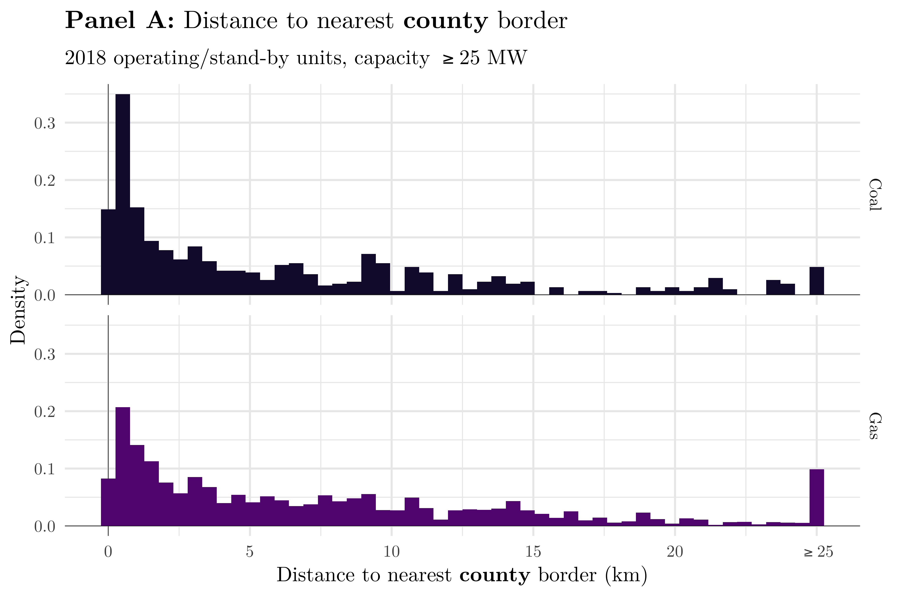

```{R, setup, include = F}
options(
  htmltools.dir.version = FALSE)
library(pacman)
p_load(
  broom, here, tidyverse,
  latex2exp, ggplot2, ggthemes, viridis, extrafont, gridExtra,
  kableExtra,
  dplyr, magrittr, knitr, parallel, tufte,emo, ggrepel, sf, hrbrthemes, lwgeom, maps, mapdata, spData,leaflet, tmap
)
# Packages
  library(pacman)
  p_load(
    tidyverse, maps, readxl, janitor,
    patchwork, viridis, extrafont, latex2exp,
    fst, data.table, lubridate,
    sf, plyr, viridis, ggsn,
    parallel, here, magrittr
  )

# Plot colors
  pc = magma(5, begin = 0.1, end = 0.9)

# Define pink color
red_pink <- "#e64173"
turquoise <- "#20B2AA"
grey_light <- "grey70"
grey_mid <- "grey50"
grey_dark <- "grey20"
# Dark slate grey: #314f4f
# Knitr options
opts_chunk$set(
  comment = "#>",
  fig.align = "center",
  fig.height = 7,
  fig.width = 10.5,
  warning = F,
  message = F
)
options(device = function(file, width, height) {
  svg(tempfile(), width = width, height = height)
})
# A blank theme for ggplot
theme_empty <- theme_bw() + theme(
  line = element_blank(),
  rect = element_blank(),
  strip.text = element_blank(),
  axis.text = element_blank(),
  plot.title = element_blank(),
  axis.title = element_blank(),
  plot.margin = structure(c(0, 0, -0.5, -1), unit = "lines", valid.unit = 3L, class = "unit"),
  legend.position = "none"
)
theme_simple <- theme_bw() + theme(
  line = element_blank(),
  panel.grid = element_blank(),
  rect = element_blank(),
  strip.text = element_blank(),
  axis.text.x = element_text(size = 18, family = "STIXGeneral"),
  axis.text.y = element_blank(),
  axis.ticks = element_blank(),
  plot.title = element_blank(),
  axis.title = element_blank(),
  # plot.margin = structure(c(0, 0, -1, -1), unit = "lines", valid.unit = 3L, class = "unit"),
  legend.position = "none"
)
theme_axes_math <- theme_void() + theme(
  text = element_text(family = "MathJax_Math"),
  axis.title = element_text(size = 22),
  axis.title.x = element_text(hjust = .95, margin = margin(0.15, 0, 0, 0, unit = "lines")),
  axis.title.y = element_text(vjust = .95, margin = margin(0, 0.15, 0, 0, unit = "lines")),
  axis.line = element_line(
    color = "grey70",
    size = 0.25,
    arrow = arrow(angle = 30, length = unit(0.15, "inches")
  )),
  plot.margin = structure(c(1, 0, 1, 0), unit = "lines", valid.unit = 3L, class = "unit"),
  legend.position = "none"
)
theme_axes_serif <- theme_void() + theme(
  text = element_text(family = "MathJax_Main"),
  axis.title = element_text(size = 22),
  axis.title.x = element_text(hjust = .95, margin = margin(0.15, 0, 0, 0, unit = "lines")),
  axis.title.y = element_text(vjust = .95, margin = margin(0, 0.15, 0, 0, unit = "lines")),
  axis.line = element_line(
    color = "grey70",
    size = 0.25,
    arrow = arrow(angle = 30, length = unit(0.15, "inches")
  )),
  plot.margin = structure(c(1, 0, 1, 0), unit = "lines", valid.unit = 3L, class = "unit"),
  legend.position = "none"
)
theme_axes <- theme_void() + theme(
  text = element_text(family = "Fira Sans Book"),
  axis.title = element_text(size = 18),
  axis.title.x = element_text(hjust = .95, margin = margin(0.15, 0, 0, 0, unit = "lines")),
  axis.title.y = element_text(vjust = .95, margin = margin(0, 0.15, 0, 0, unit = "lines")),
  axis.line = element_line(
    color = grey_light,
    size = 0.25,
    arrow = arrow(angle = 30, length = unit(0.15, "inches")
  )),
  plot.margin = structure(c(1, 0, 1, 0), unit = "lines", valid.unit = 3L, class = "unit"),
  legend.position = "none"
)


```


```{css, echo=FALSE}
@media print {
  .has-continuation {
    display: block;
  }
}
```

# Air Quality Regulation


Air-quality regulation in the US has typically followed a federalist approach.

The Clean Air Act of 1963 (and subsequent amendments):

---

count: false
# Air Quality Regulation

Air-quality regulation in the US has typically followed a federalist approach.

 The Clean Air Act of 1963 (and subsequent amendments):

  - __Federal__ agencies set national ambient air quality standards (NAAQS)
  
  - __State__ governments enforce NAAQS (setting implementation plans, among other things)
  
  - __Local__ governments monitor air quality and participate in siting polluters/monitors
  
---


count: false
# Air Quality Regulation

Air-quality regulation in the US has typically followed a federalist approach.

The Clean Air Act of 1963 (and subsequent amendments):


  - __Federal__ agencies set national ambient air quality standards (NAAQS)
  
  - __State__ governments enforce NAAQS (setting implementation plans, among other things)
  
  - __Local__ governments monitor air quality and participate in siting polluters/monitors
  
  
.red_b[Problem]: Air pollution can travel long distances and not all counties are monitored

  - Regulation & enforcement are complicated!


---


# Our paper

This paper has 3 main goals:


---


count: false
# Our paper

This paper has 3 main goals:

**1.** Describe the geography of a major class of polluters: power plants


---

count: false
# Our paper

This paper has 3 main goals:

**1.** Describe the geography of a major class of polluters: power plants

**2.** Identify reasons (both strategic _and_ non-strategic) for observed patterns


---

count: false
# Our paper

This paper has 3 main goals:

**1.** Describe the geography of a major class of polluters: power plants

**2.** Identify reasons (both strategic _and_ non-strategic) for observed patterns

**3.** Illustrate the extent of the pollution-transport problem

---


count: false
# Our paper

This paper has 3 main goals:

**1.** Describe the geography of a major class of polluters: power plants

**2.** Identify reasons (both strategic _and_ non-strategic) for observed patterns

**3.** Illustrate the extent of the pollution-transport problem

.red_b[Why?] Air-pollution regulation and monitoring is fraught with complexity.

   We shed light on additional challenges regulators face under the current, federalist system.
  
---


# Literature

In general, our work is related to two strands of literature:

__Strategy and the CAA__


---


count: false
# Literature

In general, our work is related to two strands of literature:

__Strategy and the CAA__ 

+ Downwind siting for polluters as a strategy (_e.g._ Monogan III et. al (2017))

+ Strategic abatement decisions (_e.g._ Zou, 2020) 

+ Strategic _monitor_ placement (_e.g._ Grainger et. al, 2018)


---


count: false
# Literature

In general, our work is related to two strands of literature:

__Strategy and the CAA__

+ Downwind siting for polluters as a strategy (_e.g._ Monogan III et. al (2017))

+ Strategic abatement decisions (_e.g._ Zou, 2020) 

+ Strategic _monitor_ placement (_e.g._ Grainger et. al, 2018)


__Pervasiveness and problems with pollution transfer__

+ Sergi et. al (2020), Wang et. al (2020), Tessum et. al (2017)

  + Quantify extent of pollution transport in general + costs (health damages)

---


class: middle, inverse, center
# The Geography of US Power Plants

---


# Data Sources


.red_b.purple[Generator Data:] `Emissions & Generation Integrated Database (eGRID)` and `EPAs EmPOWER Air Data Challenge`.
    

---


count: false
# Data Sources


.red_b.purple[Generator Data:] `Emissions & Generation Integrated Database (eGRID)` and `EPAs EmPOWER Air Data Challenge`. 
    
.red_b.purple[Geography:] 

  - `US Census Bureau Tiger/Line` shapefiles for county, state, and water features.  
  
  - `EPA's Greenbook NAYRO` file for county non-attainment histories 


---


count: false
# Data Sources


.red_b.purple[Generator Data:] `Emissions & Generation Integrated Database (eGRID)` and `EPAs EmPOWER Air Data Challenge`. 
    
    
.red_b.purple[Geography:] 

  - `US Census Bureau Tiger/Line` shapefiles for county, state, and water features.  
  
  - `EPA's Greenbook NAYRO` file for county non-attainment histories 


.red_b.purple[Meteorology:] `NOAA's North American Regional Reanalysis` (NARR) daily data

   Historic wind patterns at various pressure levels. 32km $\times$ 32km grid cells across contigous US

---


# Distances to County Borders

```{R,county_dist, out.width = "90%", out.height = "90%", echo = F,fig.cap = ""}

```

---

count: false
# Distances to County Borders

```{R,county_dist2, out.width = "90%", out.height = "90%", echo = F,fig.cap = ""}

```

---


# Distances to State Borders

```{R,state_dist, out.width = "90%", out.height = "90%", echo = F,fig.cap = ""}

```

---


count: false
# Distances to State Borders

```{R,state_dist2, out.width = "90%", out.height = "90%", echo = F,fig.cap = ""}

```

---


# Water Borders: Example

.col-left[
```{R, oregon_border, out.width = "80%", out.height = "80%", echo = F}
include_graphics("figures/borders-water-41.png")
```

```{R, la_border, out.width = "80%", out.height = "80%", echo = F}
include_graphics("figures/borders-water-22.png")
```

]
.col-right[

```{R, sd_border, out.width = "80%", out.height = "80%", echo = F}

```

```{R, sc_border, out.width = "80%", out.height = "80%", echo = F}

```

]


---


# A test for regulatory avoidance

We can't say strategy .red_b[caused] border siting.


---

count: false
# A test for regulatory avoidance

We can't say strategy .red_b[caused] border siting.

.red_b[Question:] Do power-plants (excluding maybe wind) use the ratio of upwind/downwind area within their own county/state to produce electricity?


---

count: false
# A test for regulatory avoidance

We can't say strategy .red_b[caused] border siting.

.red_b[Question:] Do power-plants (excluding maybe wind) use the ratio of upwind/downwind area within their own county/state to produce electricity?

  - Seems unlikely
  
  - This is the basis for our identification strategy.

---


count: false
# A test for regulatory avoidance

We can't say strategy .red_b[caused] border siting.

.red_b[Question:] Do power-plants (excluding maybe wind) use the ratio of upwind/downwind area within their own county/state to produce electricity?

  - Seems unlikely
  
  - This is the basis for our identification strategy.
  
  -  Why would a smaller downwind area within a county be advantageous for a polluter? .red_b[Emissions will exit the jurisdiction faster].


---


count: false
# A test for regulatory avoidance

We can't say strategy .red_b[caused] border siting.

.red_b[Question:] Do power-plants (excluding maybe wind) use the ratio of upwind/downwind area within their own county/state to produce electricity?

  - Seems unlikely
  
  - This is the basis for our identification strategy.
  
  -  Why would a smaller downwind area within a county be advantageous for a polluter? .red_b[Emissions will exit the jurisdiction faster].

__Main Idea:__ In the absence of regulatory avoidance, it should be a 50-50 flip whether the county’s area downwind of the plant (in the EGU’s county of residence) is larger or smaller than the area upwind.

  - .red_b[Focus]: coal. Strongest incentive to avoid regulation.
  
  - .red_b[Placebo]: natural gas. Less incentive to avoid regulation.
  


---


# Downwind vs. Upwind Area

```{R, upwind_downwind_1, out.width = "100%", out.height = "100%", echo = F,fig.cap = ""}

```

---


# Formalizing the test

Our test is implemented via a .red_b[Fisher's exact test]

.col-left[

- Sharp Null: _no strategic siting to reduce downwind area_

]


---


count: false
# Formalizing the test

Our test is implemented via a .red_b[Fisher's exact test]

.col-left[

- Sharp Null: _no strategic siting to reduce downwind area_

- Test stat $n_s\stackrel{H_0}{\sim} B(N_T,.5)$

  - $n_s$: # plants for whom downind area $<$ upwind area
  - $N_T$: total # plants (within fuel type)
  
- $p(n_s) =\sum\limits_{x = n_s}^{N^T}{N_T \choose x}\times 0.5^{N_T}$

]


---


count: false
# Formalizing the test

Our test is implemented via a .red_b[Fisher's exact test]

.col-left[

- Sharp Null: _no strategic siting to reduce downwind area_

- Test stat $n_s\stackrel{H_0}{\sim} B(N_T,.5)$

  - $n_s$: # plants for whom downind area $<$ upwind area
  - $N_T$: total # plants (within fuel type)
  
  
- $p(n_s) =\sum\limits_{x = n_s}^{N^T}{N_T \choose x}\times 0.5^{N_T}$

]

.col-right[

`r emo::ji("heavy_plus_sign")` Simple and plausible identifiying assumption

`r emo::ji("heavy_plus_sign")` Calculate _exact_ p-values. No parameteric assumptions required!

`r emo::ji("heavy_plus_sign")` Convenient falsificaton test: Natural gas

]

---


count: false
# Formalizing the test

Our test is implemented via a .red_b[Fisher's exact test]

.col-left[

- Sharp Null: _no strategic siting to reduce downwind area_

- Test stat $n_s\stackrel{H_0}{\sim} B(N_T,.5)$

  - $n_s$: # plants for whom downind area $<$ upwind area
  - $N_T$: total # plants (within fuel type)
  
  
- $p(n_s) =\sum\limits_{x = n_s}^{N^T}{N_T \choose x}\times 0.5^{N_T}$

]

.col-right[

`r emo::ji("heavy_plus_sign")` Simple and plausible identifiying assumption

`r emo::ji("heavy_plus_sign")` Calculate _exact_ p-values. No parameteric assumptions required!

`r emo::ji("heavy_plus_sign")` Convenient falsificaton test: Natural gas

`r emo::ji("heavy_minus_sign")` Major drawback: cannot capture more nuanced strategy


]

---


# Strategic Siting: Main Results

```{R, strategy_results1, out.width = "80%", out.height = "80%", echo = F,fig.cap = ""}


```


---

count: false
# Strategic Siting: Main Results

```{R, strategy_results2, out.width = "80%", out.height = "80%", echo = F,fig.cap = ""}


```


---

class: middle, inverse, center
# The Geography of US Coal Emissions

---


# Overview

We quantify the nature of the pollution transfer problem


  
---


count: false
# Overview

We quantify the nature of the pollution transfer problem.

__Model__: __HY__brid __S__ingle-__P__article __L__agrangian __I__ntegrated __T__rajectory (HYSPLIT) 

  - Atmospheric dispersion model. Heavily vetted by NOAA. 
  
  - Performs better than many other models (such as InMAP) for _long-distance_ pollution transport modeling.
 

  
---


count: false
# Overview

We quantify the nature of the pollution transfer problem.

__Model__: __HY__brid __S__ingle-__P__article __L__agrangian __I__ntegrated __T__rajectory (HYSPLIT) 

  - Atmospheric dispersion model. Heavily vetted by NOAA. 
  
  - Performs better than many other models (such as InMAP) for _long-distance_ pollution transport modeling.
 
 
 - Coal-based particles will travel much further than other sources of PM.

  
---


# Hysplit: Goals

We do the following:

 1) Quantify how quickly coal-based particles leave their own county and state (it's fast).
 
 2) Quantify the proportion of coal-based emissions that are from other counties/states in any given county/state.
 
 3) Illustrate the implications of 1) and 2) with case studies.
 
 
---
 
# Example Plants
 
```{R, example_plants1, out.width = "90%", out.height = "90%", echo = F,fig.cap = ""}


```
 
---

count: false
# Example Plants
 
```{R, example_plants2, out.width = "90%", out.height = "90%", echo = F,fig.cap = ""}


```
 
---

# Emissions Transport: Speed

```{R, hysplit_speed, out.width = "100%", out.height = "100%", echo = F,fig.cap = ""}


```
---


# Emissions Transport: Speed

```{R, hysplit_speed2, out.width = "100%", out.height = "100%", echo = F,fig.cap = ""}


```
---


# Emissions Transport: Shares

```{R, hysplit_shares1, out.width = "100%", out.height = "100%", echo = F,fig.cap = ""}


```
---


class: middle, inverse, center

# Discussion

---

# What did we do?

__Main contributions__:

  - Descriptive results on the geography of physical power plants _and_ their emissions.
  
    - Causal evidence of coal plants strategically locating to minimize downwind area.
  
  - Clean Air Act did not seem to impact strategic siting. 
  
  - Descriptive results on pervasiveness of pollution transport problem from coal powered plants.


---


class: middle, inverse, center
# Thank you!

email: jmorehou@uoregon.edu

web: www.johnmmorehouse.com

---

exclude: true
 

 


